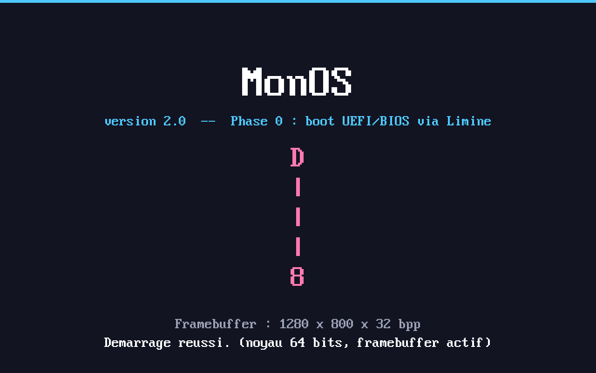

# MonOS v2 — système d'exploitation x86_64 avec interface graphique

MonOS v2 est la refonte « grande échelle » du mini-OS 16/32 bits initial (conservé
dans [`legacy/`](legacy/)). Objectif : démarrer sur du **vrai matériel** (UEFI,
fallback BIOS legacy), passer en **long mode 64 bits**, obtenir un **framebuffer
linéaire**, puis bâtir progressivement pilotes, interface graphique, applications,
utilisateurs et privilèges.

Le noyau est écrit en **C autonome (freestanding) + NASM** pour le bas niveau.
Le démarrage (UEFI/BIOS, long mode, pagination initiale, framebuffer, memory map,
ACPI) est délégué au chargeur **[Limine](https://github.com/limine-bootloader/limine)**,
ce qui permet de concentrer l'effort sur le noyau lui-même.

> **État actuel : Phase 0 terminée.** L'image démarre en QEMU **UEFI (OVMF)** *et*
> **BIOS legacy**, atteint le noyau 64 bits et affiche un écran d'accueil graphique
> dans le framebuffer (titre, infos vidéo, mascotte). Les phases suivantes
> (mémoire, interruptions, pilotes, GUI…) sont décrites dans la feuille de route.



## Pourquoi Limine (et pas un bootloader UEFI maison) ?

- Une **seule image hybride** démarre en **UEFI et en BIOS legacy**, et elle est
  directement **`dd`-able sur clé USB**.
- Limine fournit ce dont on a besoin pour du matériel moderne : **long mode**,
  **pagination initiale**, **framebuffer linéaire via GOP** (UEFI) ou VBE (BIOS),
  **memory map**, **RSDP/ACPI**, infos **SMP**.
- Le noyau reste un **ELF64 classique** compilé avec le `gcc` de l'hôte (pas besoin
  de cross-compilateur ni d'écrire le PE32+/conventions UEFI à la main).

L'esprit « on écrit nous-mêmes le noyau et tous les pilotes » est conservé ; on
délègue seulement l'amorçage firmware, sans valeur pédagogique propre.

## Feuille de route (développement incrémental, une étape testée à la fois)

| Phase | Contenu | État |
|------:|---------|------|
| **0** | Socle de build, boot Limine UEFI+BIOS, framebuffer, splash + mascotte | ✅ **fait** |
| 1 | GDT, IDT, exceptions, PIC→APIC, timer (PIT/LAPIC), log série | à venir |
| 2 | Gestion mémoire : PMM (bitmap), VMM (pagination 64 bits), tas noyau | à venir |
| 3 | Entrées PS/2 : clavier (AZERTY) + souris, file d'événements | à venir |
| 4 | PCI, stockage AHCI/SATA, système de fichiers FAT32 (lecture/écriture) | à venir |
| 5 | Compositeur graphique (double buffering), primitives de dessin | à venir |
| 6 | Gestionnaire de fenêtres, focus, z-order, barre des tâches | à venir |
| 7 | Framework de pilotes (enregistrement, classes, énumération) | à venir |
| 8 | Applications : terminal, explorateur de fichiers, paramètres | à venir |
| 9 | Comptes utilisateurs, authentification au boot, privilèges | à venir |
| 10 | *(ambitieux)* ring 3 + appels système | bonus |
| 11 | *(bonus)* xHCI + USB HID, SMP, NVMe | bonus |

## Dépendances (Debian / Ubuntu)

```bash
sudo apt-get update
sudo apt-get install build-essential nasm gcc binutils \
                     qemu-system-x86 ovmf xorriso mtools dosfstools
```

| Outil | Rôle |
|-------|------|
| `gcc`, `binutils` (`ld`) | compilation du noyau C autonome (ELF64) |
| `nasm` | code assembleur bas niveau (phases suivantes) |
| `qemu-system-x86` | test en machine virtuelle |
| `ovmf` | firmware **UEFI** pour QEMU (`/usr/share/OVMF/OVMF_CODE_4M.fd`) |
| `xorriso` | fabrication de l'image ISO hybride |
| `mtools`, `dosfstools` | manipulation FAT (images, phases stockage) |

**Limine** est fourni dans [`third_party/limine/`](third_party/limine/) (binaires
de la branche `v8.x-binary` + l'outil hôte recompilé automatiquement). Aucun
téléchargement n'est nécessaire pour compiler.

## Compilation et test en QEMU

```bash
make            # compile le noyau -> build/kernel.elf
make iso        # construit l'image hybride -> build/monos.iso
make run        # lance dans QEMU avec firmware UEFI (OVMF)
make run-bios   # lance dans QEMU en BIOS legacy (SeaBIOS)
make clean      # nettoie build/
```

Au démarrage, le menu Limine apparaît (3 s), puis MonOS affiche son écran
d'accueil dans le framebuffer.

## Gravure sur clé USB

L'image `build/monos.iso` est **hybride** (isohybrid) : amorçable en UEFI et en
BIOS, et écrivable telle quelle sur une clé USB — exactement ce que fait Rufus en
mode « image dd ».

```bash
make iso
./build/flash_usb.sh /dev/sdX        # remplacer sdX par VOTRE clé USB
```

> ## ⚠️ AVERTISSEMENT — destruction de données
> `dd` (et `flash_usb.sh`) **écrasent définitivement** le disque cible. Si vous
> indiquez le mauvais périphérique (par ex. votre disque système `/dev/sda`), vous
> **perdez toutes vos données, sans récupération possible**.
>
> - Identifiez la clé avec `lsblk` **avant** de lancer la commande.
> - Indiquez le **disque entier** (`/dev/sdb`), **pas une partition** (`/dev/sdb1`).
> - Le script demande une confirmation explicite et refuse les noms de partition.

Avec Rufus (Windows) : sélectionner `monos.iso` et écrire en **mode image DD**.

## Matériel supporté et limites connues

**Testé réellement (par l'auteur) :**
- ✅ QEMU `q35` + **OVMF (UEFI)** → framebuffer + noyau 64 bits.
- ✅ QEMU `q35` + **SeaBIOS (BIOS legacy)** → idem.
- Affichage : framebuffer linéaire 32 bpp (1280×800 sous OVMF par défaut).

**Pas encore testé / non implémenté à ce stade (Phase 0) :**
- ❌ Démarrage sur une **vraie machine** : l'image est conçue pour (Limine hybride,
  GOP, ESP standard), mais **non vérifié sur matériel physique** dans cet
  environnement. À tester par vos soins.
- ❌ **Entrées** (clavier/souris), **stockage**, **réseau**, **interface graphique
  interactive** : objets des phases suivantes.

**Limites structurelles à anticiper (honnêteté) :**
- Sur beaucoup de **portables modernes sans PS/2 (même émulé)**, le clavier/souris
  ne fonctionneront qu'une fois la **pile USB (xHCI + HID)** écrite (phase bonus).
  Sur desktop avec PS/2 ou « legacy USB emulation », le PS/2 suffira.
- L'affichage repose **uniquement** sur le framebuffer GOP/VBE : pas de pilote GPU
  natif, pas d'accélération 2D/3D (hors périmètre, comme convenu).

## Structure du projet

```
.
├── boot/limine.conf        # configuration du chargeur Limine
├── kernel/
│   ├── kmain.c             # point d'entrée + mini-pilote framebuffer (Phase 0)
│   ├── limine.h            # en-tête du protocole Limine (vendu)
│   ├── font8x16.h          # police bitmap 8x16 (générée depuis une fonte VGA)
│   └── link.ld             # script de liaison higher-half (0xffffffff80000000)
├── third_party/limine/     # chargeur Limine (binaires + outil hôte)
├── build/
│   └── flash_usb.sh        # gravure USB avec avertissements
├── legacy/                 # l'ancien OS 16/32 bits (conservé, voir legacy/README.md)
├── Makefile
└── README.md
```

## La mascotte

`8==D` pivoté de 90° vers la gauche = **vertical**, gland en haut, base en bas :

```
 D
 |
 |
 8
```

Affichée à l'écran d'accueil. Elle réapparaîtra dans la commande/fenêtre « À propos »
une fois le shell et la GUI en place.

## Licence

Projet pédagogique. Le code de MonOS est fourni tel quel, libre d'utilisation.
Limine est sous licence BSD-2-Clause (voir `third_party/limine/LICENSE`).
