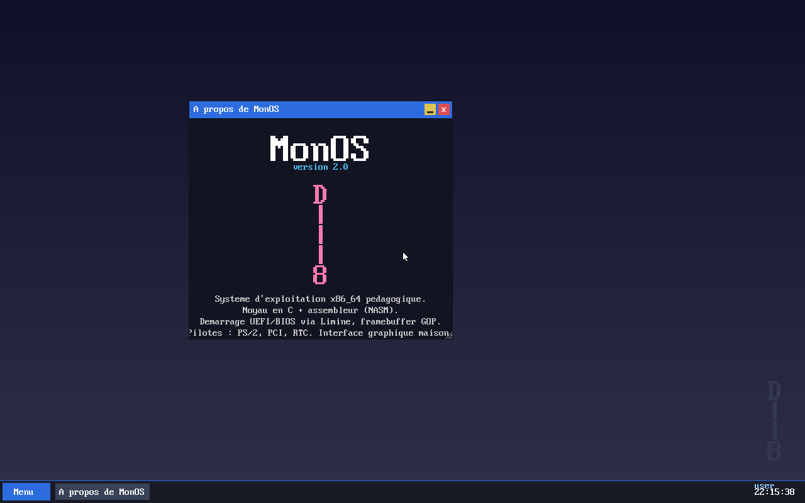
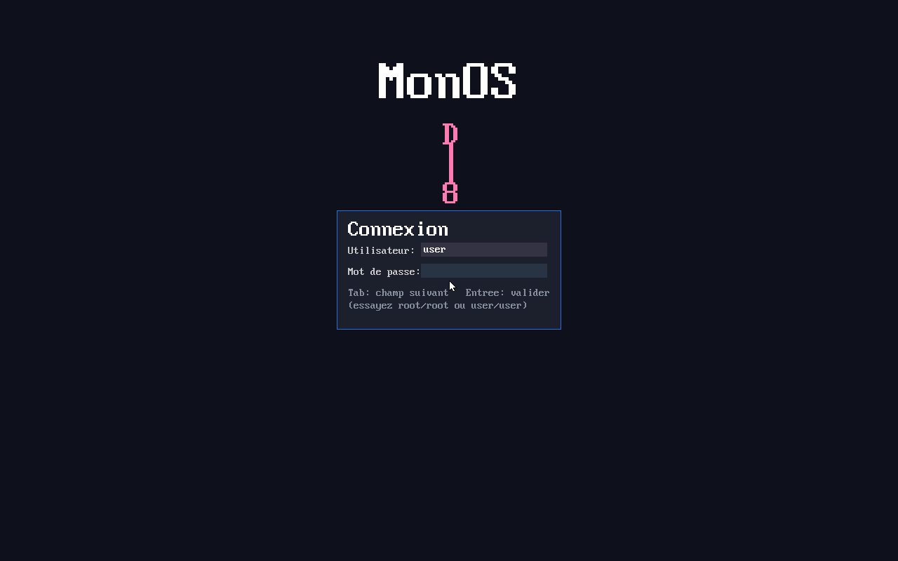
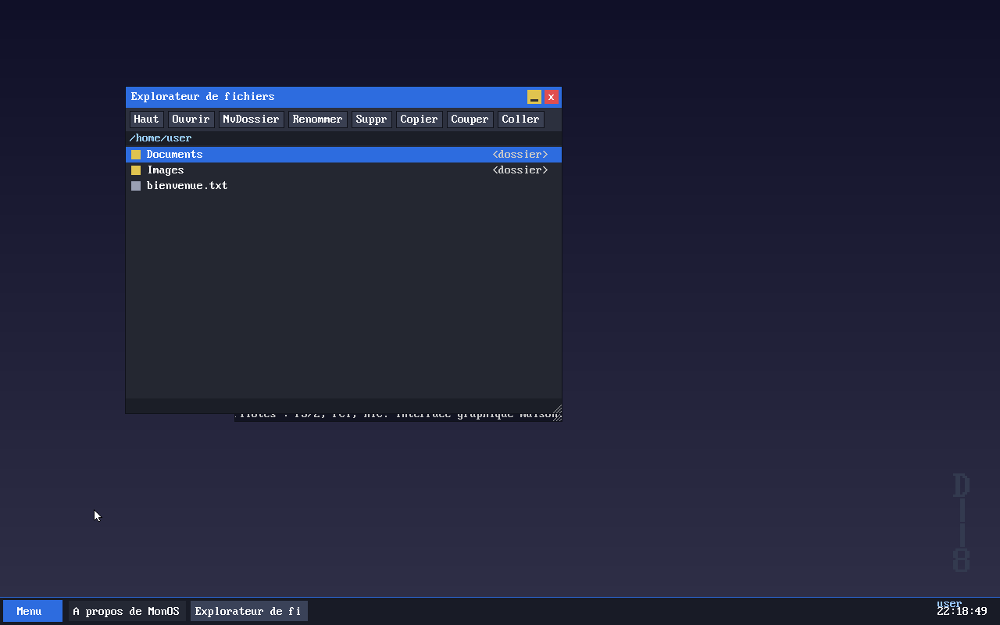
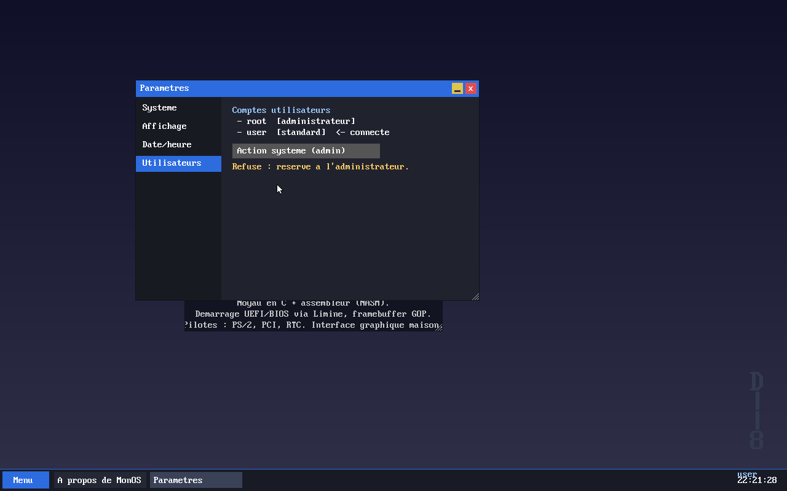

# MonOS v2 — système d'exploitation x86_64 avec interface graphique

MonOS v2 est la refonte « grande échelle » du mini-OS 16/32 bits initial (conservé
dans [`legacy/`](legacy/)). Il démarre sur **UEFI** (et **BIOS legacy** en repli),
passe en **long mode 64 bits**, obtient un **framebuffer linéaire**, et lance une
**interface graphique multi-fenêtres** avec authentification, applications et
séparation des privilèges.

Le noyau est écrit en **C autonome (freestanding) + NASM**. Le démarrage (UEFI/BIOS,
long mode, pagination initiale, framebuffer GOP, memory map, ACPI) est délégué au
chargeur **[Limine](https://github.com/limine-bootloader/limine)**.



## Captures d'écran

| Connexion | Explorateur | Privilèges |
|-----------|-------------|-----------|
|  |  |  |

## Démarrage rapide

```bash
sudo apt-get install build-essential nasm gcc binutils \
                     qemu-system-x86 ovmf xorriso mtools dosfstools
make iso        # construit build/monos.iso
make run        # lance dans QEMU avec firmware UEFI (OVMF)
```

Au démarrage : menu Limine (3 s) → écran de connexion. Comptes par défaut :
**`user` / `user`** (standard) ou **`root` / `root`** (administrateur).
*Tab* change de champ, *Entrée* valide.

## Ce qui est réellement implémenté et testé

Tout ce qui suit a été **vérifié dans QEMU** (capture du framebuffer + injection
clavier/souris), en UEFI (OVMF) **et** en BIOS legacy (SeaBIOS).

**Démarrage et noyau**
- ✅ Boot **UEFI + BIOS legacy** via Limine, image **hybride dd-able sur USB**.
- ✅ **Long mode 64 bits**, noyau ELF64 en *higher-half*.
- ✅ **Gestion mémoire** : PMM (allocateur par bitmap depuis la memory map),
  allocation contiguë (DMA/heap), tas noyau (`kmalloc`/`kfree`/`krealloc` avec
  fusion des blocs libres). La pagination est celle mise en place par Limine
  (fenêtre HHDM exploitée par le PMM).
- ✅ **GDT + TSS**, **IDT** (exceptions + IRQ), **PIC 8259** remappé, **PIT** à
  1000 Hz, **horloge RTC**, journal **port série** (COM1).

**Pilotes**
- ✅ **Clavier PS/2** (disposition **AZERTY**, Maj, touches spéciales).
- ✅ **Souris PS/2** (curseur, déplacement, boutons).
- ✅ **Bus PCI** : énumération des périphériques (affichée dans Paramètres).

**Interface graphique**
- ✅ **Compositeur** avec **double buffering** (aucun scintillement).
- ✅ Primitives : pixels, rectangles, lignes (Bresenham), texte (police bitmap
  8×16 mise à l'échelle), blit, **curseur souris**.
- ✅ **Gestionnaire de fenêtres** : fenêtres **déplaçables** (glisser la barre de
  titre), **redimensionnables** (poignée), **boutons fermer/réduire**, **focus**,
  **empilement (z-order)**, routage des clics et du clavier vers la bonne fenêtre.
- ✅ **Barre des tâches** : bouton Menu (lanceur), boutons des fenêtres ouvertes,
  horloge, nom de l'utilisateur connecté.

**Réseau** (Phase 2)
- ✅ Pilote **e1000** (Intel Gigabit, MMIO + DMA, énumération PCI), ouverture
  passive TCP (serveur).
- ✅ Pile maison : **Ethernet, ARP, IPv4, ICMP, UDP, TCP** (handshake, ACK,
  retransmission, FIN, listen/accept).
- ✅ **DHCP** (IP/masque/passerelle/DNS automatiques), **résolveur DNS**, **HTTP GET**.
- ✅ Commandes : `ifconfig`, `ping`, `nslookup`, `wget`.
- Testé en QEMU user-mode : DHCP (10.0.2.15), `ping 10.0.2.2`, DNS et HTTP réels.

**Cryptographie** (Phase 3)
- ✅ **Monocypher** (domaine public) : X25519, Ed25519, ChaCha20, Poly1305,
  SHA-512 ; **SHA-256** maison ; **CSPRNG** (RDRAND + ChaCha20).
- ✅ Validé par vecteurs de test au démarrage (SHA-256/512 FIPS, X25519, Ed25519,
  ChaCha20-Poly1305) : 0 échec.

**SSH** (Phase 3) — interopérable avec **OpenSSH 9.6**
- ✅ **Client** (`ssh hôte[:port] user motdepasse commande`) : KEX
  curve25519-sha256, clé d'hôte ssh-ed25519 vérifiée, chiffre
  `chacha20-poly1305@openssh.com`, auth mot de passe, exécution distante.
- ✅ **Serveur** (port 22) : clé d'hôte ed25519, auth contre les comptes MonOS
  (user/root), canal **exec** et **shell interactif** (pty).
- Testé dans les deux sens contre un `sshd`/`ssh` OpenSSH réel via QEMU SLIRP.

**Applications**
- ✅ **Terminal** : shell avec `help`, `clear`, `echo`, `ls`, `cd`, `pwd`, `cat`,
  `mkdir`, `touch`, `rm`, `whoami`, `date`, `sysinfo`, `ifconfig`, `ping`,
  `nslookup`, `wget`, `about`, `reboot`. **Auto-complétion Tab** (commandes +
  chemins) et **édition de ligne** complète (curseur, insertion/suppression).
- ✅ **Explorateur de fichiers** : naviguer, ouvrir, **créer un dossier**,
  **renommer**, **supprimer**, **copier/couper/coller**.
- ✅ **Paramètres** : infos système, modes d'affichage (GOP), date/heure,
  comptes utilisateurs (avec une action réservée à l'administrateur).
- ✅ **Éditeur de texte** (ouvert depuis l'explorateur), enregistrement `Ctrl+S`.
- ✅ Fenêtre **À propos** avec la mascotte.

**Utilisateurs et privilèges**
- ✅ Comptes **admin (root)** et **standard (user)**, **écran de connexion** au
  démarrage, **déconnexion**.
- ✅ **Séparation des privilèges** : un utilisateur standard ne peut écrire que
  dans son dossier personnel et se voit **refuser** les actions système ; l'admin
  y est autorisé. Vérifié dans les Paramètres et le terminal.

## La mascotte

`8==D` pivoté de 90° vers la gauche = **vertical**, gland en haut, base en bas :

```
 D
 |
 |
 8
```

Affichée à l'écran de connexion, en filigrane sur le bureau, et dans « À propos ».

## Ce qui n'est PAS implémenté (honnêteté sur le périmètre)

Conformément à la stratégie convenue (« cœur graphique d'abord, reste en bonus »),
les éléments suivants **ne sont pas faits**. Ils sont signalés sans détour :

- ❌ **Stockage disque réel (AHCI/SATA ou NVMe) et FAT32** : le système de fichiers
  est **entièrement en RAM** (ramfs). Il est pleinement fonctionnel (créer,
  supprimer, renommer, déplacer, éditer) **mais non persistant** : rien n'est écrit
  sur un disque, et il **n'est pas lisible depuis un autre OS**. C'est le principal
  écart avec l'objectif initial ; l'ajout d'un pilote AHCI + FAT32 est la prochaine
  étape logique.
- ❌ **USB (xHCI, HID, mass storage)** : non implémenté. Conséquence importante : sur
  un **PC moderne sans PS/2 (même émulé)**, le **clavier et la souris ne
  fonctionneront pas**, même si le framebuffer s'allume.
- ❌ **APIC / IOAPIC** : on utilise le **PIC 8259 hérité** (suffisant en QEMU).
- ⚠️ **Réseau** : pas de fragmentation IP, pas d'IPv6 ; TCP « simple mais
  correct » (pas de réassemblage hors-ordre).
- ⚠️ **SSH** : un seul algorithme par catégorie (curve25519-sha256 /
  ssh-ed25519 / chacha20-poly1305) ; auth par mot de passe (pas encore par clé).
- ❌ **Multi-cœurs (SMP)** : non implémenté (mono-cœur).
- ❌ **Ring 3 / appels système / isolation par processus** : les applications
  s'exécutent en **ring 0**. La séparation des privilèges est donc **logique**
  (vérifiée par le noyau), **pas** imposée par le matériel via ring 3.
- ⚠️ **Sécurité des mots de passe** : hachés par un simple djb2, **sans valeur
  cryptographique** — démonstration pédagogique uniquement.

## Matériel et environnements testés

- ✅ **QEMU `q35` + OVMF (UEFI)** → interface graphique complète, interactions
  vérifiées (login, fenêtres, explorateur, paramètres, terminal, privilèges).
- ✅ **QEMU `q35` + SeaBIOS (BIOS legacy)** → atteint l'interface graphique.
- ❌ **Vrai matériel** : **non testé** dans l'environnement de développement.
  L'image est conçue pour (Limine hybride, GOP, ESP standard) ; sur une machine
  réelle elle devrait atteindre le framebuffer, mais **les entrées dépendent de la
  présence d'un contrôleur PS/2** (voir la pile USB manquante ci-dessus).

## Compilation et exécution

```bash
make            # compile le noyau -> build/kernel.elf
make iso        # construit l'image hybride -> build/monos.iso
make run        # QEMU avec firmware UEFI (OVMF)
make run-bios   # QEMU en BIOS legacy (SeaBIOS)
make run-net    # QEMU UEFI + réseau e1000 (DHCP/DNS) + hostfwd 2222->22 (SSH)
make clean      # nettoie build/
```

### Tester le réseau et SSH

Dans le terminal MonOS (après `make run-net`) :
```
ifconfig                         # config obtenue par DHCP
ping 10.0.2.2                    # passerelle SLIRP
ssh 10.0.2.2:22 user motdepasse "uname -a"   # client SSH vers un sshd hôte
```
Depuis l'hôte, vers le **serveur SSH** de MonOS (port 22 redirigé sur 2222) :
```bash
ssh -p 2222 user@localhost       # mot de passe : user (ou root / root)
```

## Gravure sur clé USB

`build/monos.iso` est **hybride** (isohybrid) : amorçable en UEFI et BIOS, et
écrivable telle quelle sur une clé USB (comme Rufus en mode « image dd »).

```bash
make iso
./build/flash_usb.sh /dev/sdX        # remplacer sdX par VOTRE clé USB
```

> ## ⚠️ AVERTISSEMENT — destruction de données
> `dd` (et `flash_usb.sh`) **écrasent définitivement** le disque cible. Si vous
> indiquez le mauvais périphérique (par ex. votre disque système `/dev/sda`), vous
> **perdez toutes vos données, sans récupération possible**.
>
> - Identifiez la clé avec `lsblk` **avant** de lancer la commande.
> - Indiquez le **disque entier** (`/dev/sdb`), **pas une partition** (`/dev/sdb1`).
> - Le script refuse les noms de partition et exige une confirmation explicite.

Avec Rufus (Windows) : sélectionner `monos.iso`, écrire en **mode image DD**.

## Dépendances (Debian / Ubuntu)

```bash
sudo apt-get install build-essential nasm gcc binutils \
                     qemu-system-x86 ovmf xorriso mtools dosfstools
```

**Limine** est fourni dans [`third_party/limine/`](third_party/limine/) (binaires
v8.x + sources de l'outil hôte, recompilé automatiquement par le Makefile). Aucun
téléchargement n'est nécessaire pour compiler.

## Architecture du code

```
kernel/
  kmain.c            point d'entrée et orchestration
  boot.h / limine.h  interface avec le chargeur Limine
  klib.* serial.* io.h   bibliothèque de base, série, ports d'E/S
  gdt.* idt.* isr.asm cpu.asm pic.* pit.* rtc.*   cœur CPU (Phase 1)
  pmm.* heap.*       mémoire physique + tas noyau (Phase 2)
  ps2.* input.*      clavier + souris PS/2 et file d'événements (Phase 3)
  pci.*              énumération PCI
  gfx.* framebuffer.* font8x16.h   dessin et framebuffer (Phase 5)
  window.h wm.c      gestionnaire de fenêtres (Phase 6)
  desktop.*          compositeur, login, barre des tâches, boucle (Phases 6-9)
  vfs.*              système de fichiers en mémoire
  users.*            comptes, authentification, privilèges (Phase 9)
  app_*.c            terminal, explorateur, paramètres, éditeur, à propos
third_party/limine/  chargeur Limine (boot UEFI + BIOS)
legacy/              l'ancien OS 16/32 bits (conservé)
build/flash_usb.sh   gravure USB avec garde-fous
```

## Licence

Projet pédagogique, fourni tel quel. Limine est sous licence BSD-2-Clause
(voir `third_party/limine/LICENSE`).
